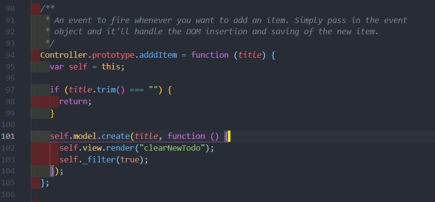
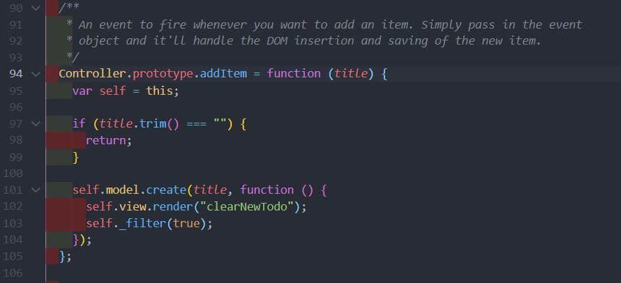
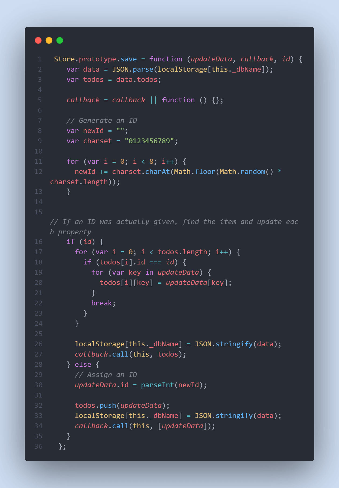
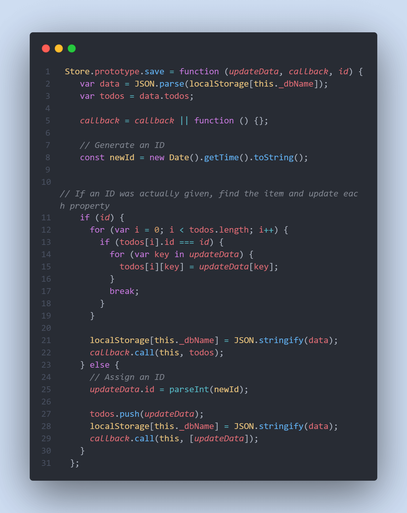
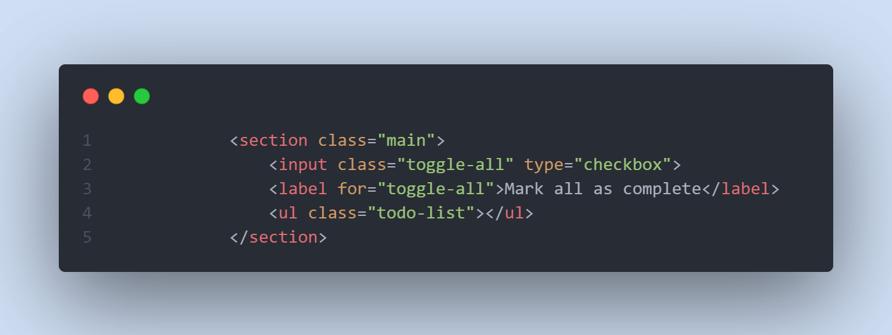
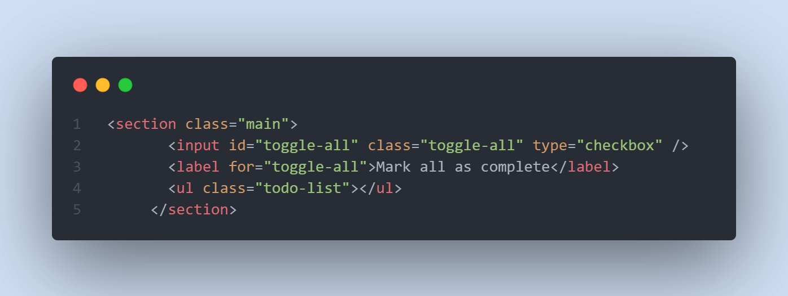
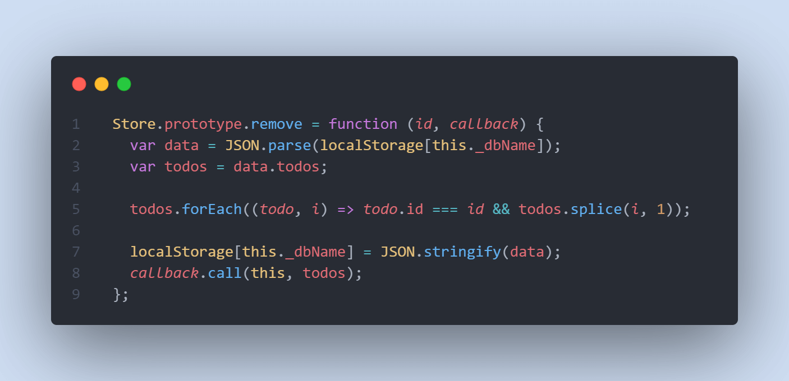
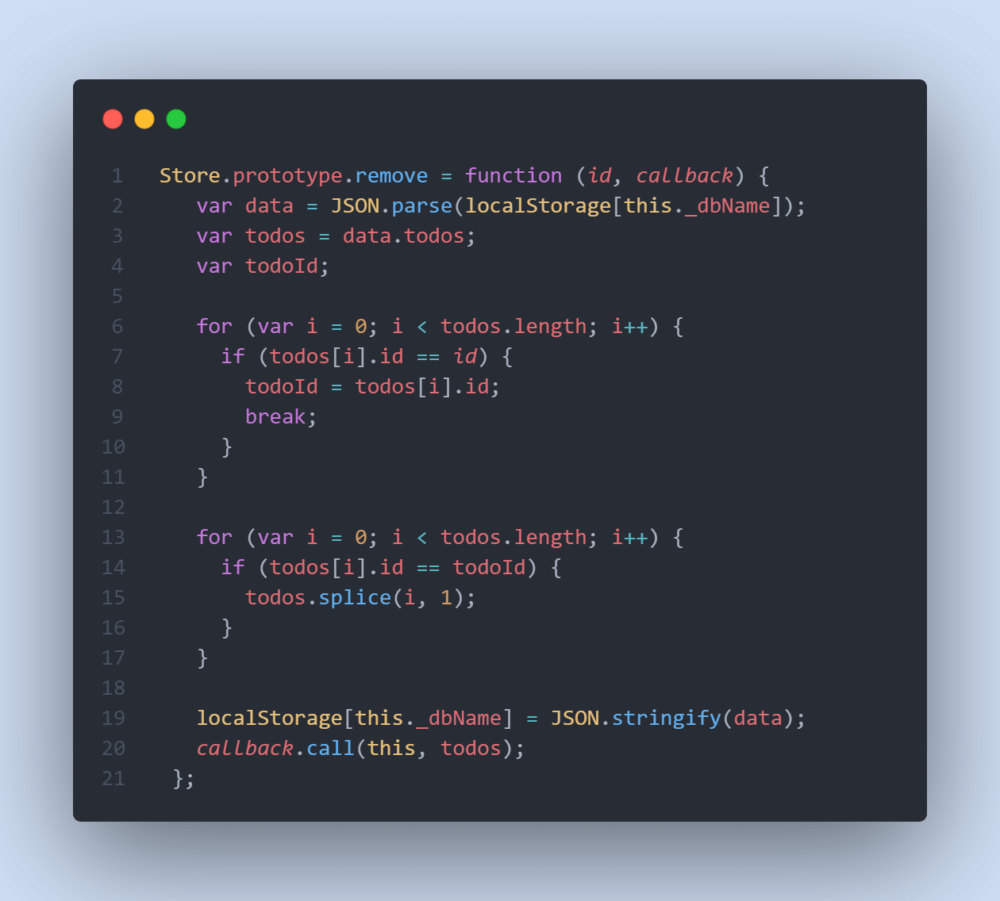
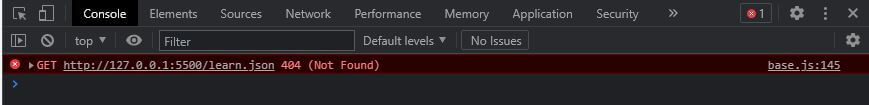

# Correction des bugs de l'application

## A propos

Un des points d'étude de ce projet était de comprendre le code écrit par un autre développeur, pour ensuite apporter une contribution.  
Lors de la reception des fichiers formant l'application un certain nombres de bugs empêchaient le lancement de l'application , la console de développement contenaient aussi certaines erreurs. La première étape a donc été de les corriger.  
Voici le résultat:

 

1. Une erreur de frappe au niveau du nom d'une fonction empchait le code de se compiler.

- Problème: la fonction addItem comportait 3 fois la lettre 'd' au lieu de 2  
   
       
     
- Solution: supprimer le d superflu  
  
    
   
   

2. L'approche utilisée pour créer des identifiants uniques pouvait amener à créer des doublons

- Problème: L'approche initiale s'appuyer sur un ensemble de 10 caractères placés aléatoirement pour former un identifiant 'unique'.  
  Bien que cela fonctionne, la possibilité que deux identifiants soient constituées des mêmes nombres placés dans le même ordre existe toujours.  

     

    
- Solution:
  - Utiliser un package tiers comme le populaire `uuid`
  - Passer par l'utilisation de timestamp. C'est cette approche qui a été choisi et qui offre l'avantage de se couper de dépendance externe.
  
      
     
     

  

3. Impossible d'utiliser le bouton 'tout marquer comme complété'

- Problème: L'approche initial est d'utiliser un pseudo élément faisant office de label pour un checkbox pour cocher ou décocher ce dernier.  
  Or dans le fichier index.html aucun id n'est spécifié, le label et le input n'étaient donc pas connectés, et rendant la fonctionnalité 'toggleAll' inopérante.

  

- Solution: Ajouter un id toggleAll sur le checkbox.  
  
  
   
   

4. Une boucle qui pourrait être optimisé:

- Problème: Bien que la fonctionne remplisse son rôle, il est possible de raccourcir son écriture en quelques lignes  
  
  
   
   
 
- Solution: utilisation de la syntaxe ES6 et du principe de 'short-circuiting'
  
   
   

5. Un message d'erreur en console avertissant l'absence d'un fichier.

- Problème:  
   
  
  le fichier learn.json est utilisé depuis `./node-modules/todomvc-common/base.js`, pour afficher des informations complémentaires sur l'application.
  Ce fichier n'est pas utile pour le bon fonctionnement de l'application.  

* Solution:  Pour supprimer l'erreur en console, le plus simple a été d'ajouter manuellement à la racine de l'application learn.json.
