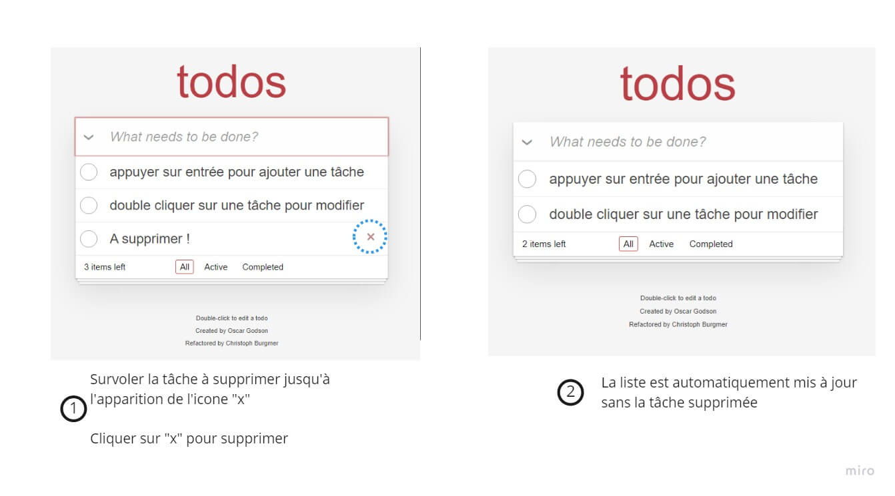

# Todo-list app: Documentation

## Sommaire
1. [A propos](#about)
2. [Fonctionnalités](#features)
   1. [Ajouter un nouveau todo](#add)
   2. [Editer un todo](#edit)
   3. [Supprimer un todo](#remove)
   4. [Marquer un todo comme "Complété"](#toggle)
   5. [Filtrer la liste de todo](#filter)
3. [Audit]

---- 
## A propos

<a id="#about" />

Todo list app est une application web qui permet de gérer une liste de choses à faire (todo).  
Cette application ne concentre que les fonctionnalités fondamentales d'une todo.  
Le but de l'étude de cette app étant surtout un moyen de se familiariser avec le pattern MVC, l'écriture de test fonctionnnels avec Jasmine ainsi que réaliser un audit de performance sur une application similaire déjà implémenter.

#### L'architecture de l'application

Le pattern MVC repose sur la division du coeur de l'application en 3 parties distinctes ayant chacune des responsabilités différentes:


Le flow dans un pattern MVC suit donc un certain ordre:

1. l'utilisateur réalise une action quelconque sur l'interface  
    (_ex : valide le texte qu'il a saisi dans un formulaire_).
2. La "View", qui contient principalement de l'HTML,  détecte l'action qu'il notifie au "Controller"
3. Le "Controller" contient la logique à éxecuter lorsque certaines actions lui sont communiquées par la View.  
 (_ex: l'utilisateur a saisie quelque chose, il faut sauvegarder ce nouvel élément_)    
Il va transmettre les bonnes instructions au "Model" pour que les données soient correctement traités.  

4. Le "Model" contient la logique pour intéragir avec la base de donnée.  
   (_ex: écrire le nouvel élément dans la base de donnée_)  
   Une fois l'opération réussie, il peut notifier le Controller que tout s'est bien déroulé.

5. Le Controller voit que l'objectif du Model est atteint, il demande à la View de se mettre à jour avec les nouvelles données.

6. L'utilisateur voit l'interface répondre correctement à son action.

  
Dans le cas de notre application Todo-list, le code remplissant le rôle de ces 3 différents blocs se trouvent dans 3 fichiers distincts:
    - Controller.js
    - Model.js
    - View.js  
    
Des fichiers supplémentaires viennent compléter ceux présentés précédemment:

- helpers.js: Contient des variables custom qui permettent une syntaxe plus succinte (ex: $qs au lieu de querySelector) et qui permet d'attacher des gestionnaires d'événement de façon plus flexible que tradionnellement (ex : $delegate). Ces variables sont disponibles globalement et peuvent donc être utilisés par tous les fichiers présents.
  
- app.js : est la porte d'entrée dans l'application. C'est ici que les informations essentielles au lancement de l'application sont déclarées et initialisées (view, model, controller, le nom de la base de donnée...)
- store.js : Contient concrètement les instructions qu'il est possible d'effectuer sur la base de donnée.   
  Le Model, après vérification des données transmis par le Controller, utilise le code présent dans le store une fois pour compléter la tâche qui lui a été assignée.
- template.js: Contient les template des différents éléments qui viennent s'ajouter au fur et à mesure des interactions.  

**Important**: 
L'application à ce stade n'utilise pas de base de donnée à proprement parlé, mais enregistre les todo en local via local storage.

  

#### En résumé voici l'arborescence des fichiers:    
  


#### Diagramme expliquant la relation entre les différents fichiers

<br >
<br >
<br >

---

<a id="features" />  

## Les différentes fonctionnalités

 

- Ajouter une nouvelle tâche 
   
    
<br >
<br >
<br >

- Editer une tâche  
  
  
<br >
<br >
<br >

- supprimer une tâche  
  
  
<br >
<br >
<br >

- Toggler une tâche  
  
  
<br >
<br >
<br >

- Filtrer par status  

  
<br >
<br >
<br >

- Tout marquer comme complété  
  

<br >
<br >
<br >

-  Tout supprimer  
  
 
<br >
<br >
<br >


--- 

## Comment ça marche ? 

###  Ajout de todo:
<a id="add">   

Les fonctions impliqués:   
*  `Controller.addItem( title)`:  
    - Arguments: 
      - title : `string`
    - Valeur de retour:  -
    - Description:   
       - Déclenché lorsqu'une action de type "newTodo" est effectué depuis la Vue 
       - Fais appel au Model pour que la nouvelle tâche soit sauvegarder dans localStorage (_Model.create()_)
       - Fais appel à la vue pour qu'elle se mette à jour (_View.render()_)
       - Utilise une de ses fonctions internes ( *_filter()*) pour que la liste de todo soit afficher dans l'interface

* `Model.create(title, callback)`:
    - Arguments: 
      - title : `string`
      - callback: `function`
    - Valeur de retour: -
    - Description:
      - Utilise title  pour créer un objet représentant la nouvelle tâche, utilisable par Store.save()
      - callback est la fonction à executer lorsque la sauvegarde de lanouvelle tâche sera effectuée.

* `Store.save(updateData, callback, id)`:
  - Arguments: 
    - updateData : `object`
    - callback: `function`
    - id: `number` (optionnel)
  - Valeur de retour: -
  - Description:
    - Vérifie si updateData n'existe pas déjà dans localStorage grâce à id.
    - Ajoute updataData au localStorage si n'existe pas.  
    - Met à a jour la liste de todo si updateData existe.
    - Execute le callback.

* `View.render(viewCmd, parameter)` : 
   - Arguments:
     - viewCmd : _string_
     - parameter : _object_ 
   - Valeur de retour: -
   - Description:
     - viewCmd représente la fonction interne qui doit être exécuté avec le parameter spécifié
     - Execution de la commande met à jour les éléments nécessaires 

* `Controller._filter(force)`:
  - Arguments : 
    - force: _boolean_ 
  - Valeur de retour: - 
  - Description:
    - Si force = true, la liste de todo affiché dans l'interface est mise à jour.  
    
<br > 

##### Diagramme déroulement d'un ajout de todo:
  

<br >
<br >


<a id="edit"> 

###  Editer un todo:

Les fonctions impliqués:  

*  `Controller.editItem( id)`:  
    - Arguments: 
      - id : `number` ou `string` ou `object`
    - Valeur de retour:  -
    - Description:   
       - Fais appel au model pour que l'élément ayant id commen identifiant soit retrouvé et modifié (via )
  
*  `Model.read(query, callback)`: 
    - Arguments: 
      - query : `number` ou `string` ou `object`
    - Valeur de retour: -
    - Description:   
       - Vérifie quel est le type de query, puis demande au Store de réaliser les opérations appropriés sur le localStorage, en se basant sur query et callback

  
*  `Store.find(query, callback)`: 
    - Arguments: 
      - query : `number` ou `string` ou `object`
    - Valeur de retour: -
    - Description:   
       - Vérifie quel est le type de query, puis demande au Store de réaliser des opérations sur le localStorage, en se basant sur query et callback


<br >
<br >

<a id="remove" />

#### Supprimer un todo:

Les fonctions impliqués:  

*  `Controller.removeItem( id)`:  
    - Arguments: 
      - id : `number` 
    - Valeur de retour:  -
    - Description:   
       - Fais appel au Model.read pour retrouver le todo ayant id comme identifiant pour qu'il soit retiré du localStorage.
       - Fais appel a View.render pour que l'interface soit mis à jour une fois que la suppression est effectuée
  
*  `Model.read(query, callback)`: 
    - Arguments: 
      - query : `number` ou `string` ou `object`
    - Valeur de retour: -
    - Description:   
      - Vérifie quel est le type de query, puis demande au Store de réaliser les opérations appropriés sur le localStorage, en se basant sur query et callback

  
*  `Store.findAll(query)`: 
    - Arguments: 
      - query : `number` ou `string` ou `object`
    - Valeur de retour: -
    - Description:   
       - Vérifie quel est le type de query, puis demande au Store de réaliser des opérations sur le localStorage, en se basant sur query et callback


<br >
<br >

<a id="remove" />

#### toggler un todo:
Fonctions impliqués:  

*  `Controller.toggleComplete(id, completed, silent)`:  
    - Arguments: 
      - id : `number` 
      - completed: `boolean` (valeur de la checkbox lié au todo 'toggler')
      - silent: `boolean` (False empeche le filtrage de la liste)
    - Valeur de retour:  -
    - Description:
       - Met à jour le statut de la tâche ayant id comme identifiant.     
       - Demande la mise a jour de la liste dans localStorage via  Model.update , et mise a jour de l'interface via View.render   
    

*  `Model.update(id, data, callback)`:  
    - Arguments: 
      - id : `number` 
      - data: `object` (contient les propriétés qui doivent être mis à jour et leurs nouvelles valeurs )
      - callback: `boolean` (contient les intructions à réaliser une fois que la mise à jour est terminée)
    - Valeur de retour:  -
    - Description:
       - Demande la sauvegarde de data via Store.save()     
       - Demande la mise a jour de la liste dans localStorage via  Model.update , et mise a jour de l'interface via View.render 

* `Model.save()`:


# Autre approche : 
#### Comment le Controller reçoit la notification 
#### Ajouter todo

```javascript
  Controller.prototype.addItem = function (title) {
    var self = this;

    if (title.trim() === "") {
      return;
    }

    self.model.create(title, function () {
      self.view.render("clearNewTodo");
      self._filter(true);
    });
  };
```
_diagramme


#### Reference


### Audit
<a id="audit"/>

**LIEN VERS WIKI**
