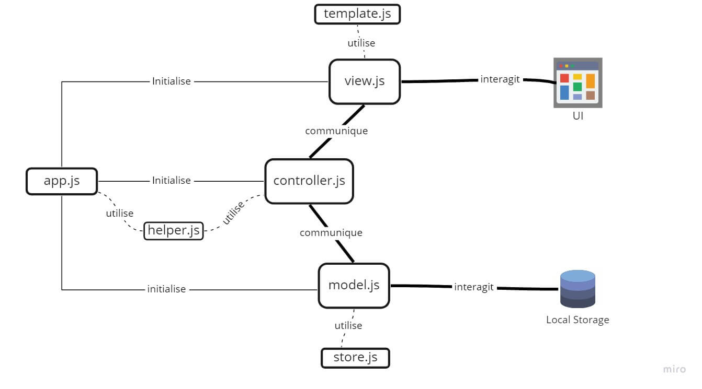

# Todo-list app: Documentation

## Sommaire
1. [A propos](#about)
2. [Fonctionnalités](#features)
   1. [Ajouter une nouvelle todo](#add)
   2. [Editer une todo existante](#edit)
   3. [Supprimer une todo spécifique](#remove)
   4. [Marquer une todo comme "Complété"](#toggle)
   5. [Filtrer la liste de todo par status](#filter)
   6. [Tout marquer comme complété](#toggleAll)
   7. [Supprimer todos complétés](#removeComplete)
3. [Référence](#reference)
4. [Audit](#audit)

---- 
## A propos

<a id="#about" />

Todo list app est une application web qui permet de gérer une liste de choses à faire (nommées 'todo').  
Cette application ne concentre que les fonctionnalités fondamentales d'une todo list.  
Le but de cette app étant surtout un moyen de se familiariser avec le pattern MVC, l'écriture de test fonctionnnels avec Jasmine ainsi que réaliser un [audit](#audit) de performance sur une application similaire et concurrente

#### L'architecture de l'application

Le pattern MVC repose sur la séparation de l'application en 3 parties distinctes (**M**odel - **V**iew - **C**ontroller), ayant chacune un rôle spécifique:


Le flow dans un pattern MVC suit donc un certain ordre:

1. l'utilisateur réalise une action quelconque sur l'interface  
    (_ex : valide le texte qu'il a saisi dans un formulaire_).
2. La "View", qui contient principalement de l'HTML,  détecte l'action qu'il notifie au "Controller"
3. Le "Controller" contient la logique à éxecuter lorsque certaines actions lui sont communiquées par la View.  
 (_ex: l'utilisateur a saisie quelque chose, il faut sauvegarder ce nouvel élément => déclenchement de lq fonction qjoutTodo_)    
Il va transmettre les bonnes instructions au "Model" pour que les données soient correctement traités.  

4. Le "Model" contient la logique pour intéragir avec la base de donnée.  
   (_ex: écrire le nouvel élément dans la base de donnée_)  
   Une fois l'opération réussie, il peut notifier le Controller que tout s'est bien déroulé.

5. Le Controller voit que l'objectif du Model est atteint, il demande à la View de se mettre à jour avec les nouvelles données.

6. L'utilisateur voit l'interface répondre correctement à son action.

  
Dans le cas de notre application Todo-list, le code remplissant le rôle de ces 3 différents blocs se trouvent dans 3 fichiers distincts:
    - Controller.js
    - Model.js
    - View.js  
    
Des fichiers supplémentaires viennent compléter ceux présentés précédemment:

- **helpers.js**: Contient des variables custom qui permettent une syntaxe plus succinte (ex: $qs au lieu de querySelector) et qui permet d'attacher des gestionnaires d'événement de façon plus flexible que tradionnellement (cf: $delegate). Ces variables sont disponibles globalement et peuvent donc être utilisés par tous les fichiers présents.
  
- **app.js** : est la porte d'entrée dans l'application. C'est ici que les informations essentielles au lancement de l'application sont déclarées et initialisées (view, model, controller, le nom de la base de donnée...)
  
- **store.js** : Contient concrètement les instructions qu'il est possible d'effectuer sur la base de donnée.   
  Le Model, après vérification des données transmis par le Controller, utilise le code présent dans le store une fois pour compléter la tâche qui lui a été assignée.
- template.js: Contient les template des différents éléments qui viennent s'ajouter au fur et à mesure des interactions.  

**Important**: 
L'application à ce stade n'utilise pas de base de donnée à proprement parlé, mais enregistre les todo en local, dans le localStorage.

  

#### En résumé voici l'arborescence des fichiers principaux:    
  


#### Diagramme expliquant la relation entre les différents fichiers

<br >
<br >
<br >

---

<a id="features" />  

<br />

## Les différentes fonctionnalités
<br />


<a id="add" />   

- Ajouter une nouvelle todo
  
    
<br />

Description: [Controller.prototype.addItem()](#addItem)  

L'ajout d'une nouvelle tâche est déclenchée lorsque l'utilisateur valide sa saisie depuis l'interface (appuie sur entrée).

Le Controller perçoit cette demande d'ajout comme un événement appelé "newTodo", reçoit ce que l'utilisateur souhaite ajouter sous forme d'une `String` , et execute alors les instructions écrites dans sa méthode **[addItem](#addItem)**:  

Demande au Model de créer un nouveau todo basé sur ce que l'utilisateur a écrit, l'enregistrer dans le localStorage, et d'éxécuter le callback, qui lui est passé en argument, une fois que la sauvegarde a été effectué.

Ce callback indique à la View ce qui doit être mis à jour dans l'UI suite à la création d'une nouvelle tâche.

<br />
<br />  
  
<a id="edit" /> 

- Editer une todo existante


<br />    

Description: [Controller.prototype.editItem()](#editItem)

Cette méthode est appelé en réponse au double clique de l'utilisateur sur une tâche présente dans la liste.
Lors de cet événement "itemEdit", l'`id` lié cette tâche est passé à la méthode du Controller [editItem](#editItem).  
  
Lors de l'éxécution de cette méthode, `id` est passé au Model pour que la todo qui y est lié soit retrouvé depuis localStorage et utilisable pour la suite, grâce à [Model.read](#read) . En second argument un callback, éxécuté lorsque le bon todo a été retrouvé du localStorage.  

Lors de l'éxécution de callback les données retrouvées sont passés en argument à la View via [View.render](#render) pour que le contenu édité soit mis à jour.

<br />
<br />


<a id='remove' />

- Supprimer une todo spécifique 


<br />  

Description: [Controller.prototype.remove()](#modelRemove)  

Déclenché lors d'un événement "itemRemove".  
Reçoit alors le `id` de l'élément à supprimer.  
[Model.remove](#modelRemove) est appelé, en utilisant `id` pour supprimer de localStorage le bon élément.  
La View est mis à jour une fois la suppression faite, via le callback passé en argument à Model.remove.  
Ce callback utilise [View.render](#render) avec `removeItem`, avec `id` pour que l'interface soit correctement mis à jour. 
<br />
<br />


<a id='toggle' />

- Marquer une todo comme "Complété" 
<br />


  
<a id="explain-toggleComplete">

Description: [Controller.prototype.toggleComplete()](#toggleComplete)


  Déclenché lors d'un événement "itemToggle". Reçoit alors un objet `item`, contenant l'id et le statut de la tâche à mettre à jour.  
  [Controller.toggleComplete](#toggleComplete) se charge de fournir l'id à [Model.update](#modelUpdate) en premier argument
  En second, un objet ```{ completed: true | false }``` en fonction de la valeur de la checkbox associée à l'élément.
  En troisième, un callback executé lorsque la mise a été faite pour que l'interface affiche les informations à jour.  
<br />
<br />


<a id='filter'>

- Filtrer par status  


<br />

L'application se base sur des routes pour render les bons éléments. Une route étant consituée de l'url et d'une destination précédée d'un "#".  
Il exite 3 routes possibles: 
- localhost:_PORT_/#**all** ou **/**
- localhost:_PORT_/#**active**
- localhost:_PORT_/#**completed**

Trois liens (stylisés en bouton) labellisés "All", "Active" et "Completed" permettent à l'utilisateur d'accéder aux routes associées. 

Pour que l'interface soit correctement affichée, trois méthodes sont utilisables: 

* Afficher toutes les tâches: [Controller.prototype.showAll()](#showAll):  
* Afficher uniquement les tâches complétés: [Controller.prototype.showActive()](#showActive)
* Afficher uniquement les tâches actives: [Controller.prototype.showCompleted()](#showCompleted) 

Le Controller garde en permanence "en mémoire" la destination active (celle où se trouve actuellement l'utilisateur) et la destination précédente et ce depuis le tout premier lancement de l'application. (_Destination par défaut au lancement: "/", équivalent à "/all"_ ).    
De plus, chaque changement d'url déclenche [Controller.prototype.setView()](#setView).     
Ce changement est dû à l'utilisation d'_anchored link_ (d'ou le "#" dans l'url)

A chaque changement d'url **setView** est appelé, execute un appel à [_filter()](#filter), ce qui à terme met à jour les données de la page.  

Description: [Controller.prototype._filter()](#filter)    
Cette méthode s'appuie sur la destination active en la comparant à la destination précédente (est ce qu'il y au eu un changement de destination depuis le dernier appel de _filter? ) pour que la bonne méthode parmi show[all|active|completed] soit appelée, et ainsi afficher les bons éléments dans l'interface.

Le principe de fonctionnement est le suivant : 
1. L'utilisateur se trouve sur la page listant toutes les tâches ('/#all'), il ne souhaite voir que celle déjà complétées: il clique sur le bouton "Completed".
2. setView est déclenché car changement d'url (maintenant '/#completed'), ce qui va permettre d'executer _filter. Il compare alors la derniere route active('all') à la route active("completed").
3. "completed" !== "all" donc _filter fait appel à showCompleted.
4. L'utilisateur voit l'interface avec la liste de todo complété.
<br />
<br />


<a id='toggleAll' />
- Tout marquer comme complété
    
<br > 
  


Description: [Controller.prototype.toggleAll()](#toggleAll)  

Cette méthode est executée lorsqu'un évènement de type "toggleAll" est reçu par le Controller, autrement dit lorsque l'utilisateur utilise la checkbox .toggleClass.
Lorsque cela se produit, la valeur de l'attribut "checked" (true si la case est cochée, false sinon) est passé en argument.  
[Model.read](#read) est appelé avec pour arguments un objet contenant la valeur **contraire** de la checkbox, et un callback executé lorsque le model aura terminé son travail.   
En passant la valeur contraire de la checkbox(true alors false est passé) comme critère de recherche au Model, on s'assure que seul les tâches correspondantes (les tâches ayant leur statut "completed" égal à false) seront retournés du localStorage, et non pas toute l'entièreté de la liste.  

Ce callback va permettre d'itérer sur toutes les todos présentes en passant leur statut "completed" de false, à true.  
Enfin, La liste et l'interface est mis à jour via [toggleComplete](#explain-toggleComplete)
<br >
<br >


<a id='removeComplete' /> 

-  Supprimer todos complétés  
  
 
<br >

Description: [Controller.prototype.removeCompletedItems()](#removeCompletedItems)
Déclenché par événement "removeCompleted", qui fait suite au clic de l'utilisateur sur le lien "clearCompleted".  
Le Controller execute alors sa méthode [removeCompletedItems](#removeCompletedItems).  
Celle ci demande au Model de retrouver dans la BDD toutes les todos ayant comme statut "Completed" évalué à true, et d'executer le callback passé en second argument.  
Ce callback va itérer sur la liste retournée par le Model, et faire appel à [removeItem](#explain-removeItem) pour chaque correspondance soit supprimé.  

<br >
<br >


--- 


<a id="reference" />

#### Référence

##### Model

<a id="create"/>

* `Model.prototype.create(title, callback)`:
    - Arguments: 
      - title : `string`
      - callback: `function`
    - Valeur de retour: -
    - Description:
      - Utilise title  pour créer un objet représentant la nouvelle tâche, utilisable par Store.save()
      - callback est la fonction à executer lorsque la sauvegarde de lanouvelle tâche sera effectuée.
<br />
<br />


<a id="read"/>

* `Model.prototype.read(query, callback)`: 
    - Arguments: 
      - query : `number` ou `string` ou `object`
    - Valeur de retour: -
    - Description:   
      - Vérifie quel est le type de query, puis demande au Store de réaliser les opérations appropriés sur le localStorage, en se basant sur query et callback
<br />
<br />


<a id='modelRemove'>

* `Model.prototype.remove(query, callback)`: 
    - Arguments: 
      - id : `number` 
      - callback: `function`
    - Valeur de retour: -
    - Description:   
      - Passe l'id et le callback au Store pour que l'élèment ayant l'id soit supprimé de localStorage.  
      - Une fois supprimé, le callback est executé pour mettre à jour la View.
<br />
<br />


<a id='modelUpdate'>

* `Model.prototype.update(id, data, callback)`: 
    - Arguments: 
      - id : `number` 
      - data : `objet`
      - callback: `function`
    - Valeur de retour: -
    - Description:   
      - Demande au Store de retrouver l'élément ayant id comme identifiant, de mettre à jour cet élément avec data et enfin d'executer le callback.
<br />
<br />


##### View
<a id="render"/>

* `View.prototype.render(viewCmd, parameter)` : 
   - Arguments:
     - viewCmd : _string_
     - parameter : _object_ 
   - Valeur de retour: -
   - Description:
     - viewCmd représente la fonction interne qui doit être exécuté avec le parameter spécifié
     - Execution de la commande met à jour les éléments nécessaires 
<br />
<br />


##### Controller

<a id='addItem' />

*  `Controller.prototype.addItem( title)`:  
    - Arguments: 
      - title : `string`
    - Valeur de retour:  -
    - Description:   
       - Déclenché lorsqu'une action de type "newTodo" est effectué depuis la Vue 
       - Fais appel au Model pour que la nouvelle tâche soit sauvegarder dans localStorage (_Model.create()_)
       - Fais appel à la vue pour qu'elle se mette à jour (_View.render()_)
       - Utilise une de ses fonctions internes ( *_filter()*) pour que la liste de todo soit afficher dans l'interface
<br />
<br />


<a id="editItem" /> 

*  `Controller.prototype.editItem(id)`:  
    - Arguments: 
      - id : `number` ou `string` ou `object`
    - Valeur de retour:  -
    - Description:   
       - Fais appel au model pour que l'élément ayant id commen identifiant soit retrouvé et modifié (via )
<br />
<br />


<a id='filter'>

* `Controller.prototype._filter(force)`:
  - Arguments : 
    - force: _boolean_ 
  - Valeur de retour: - 
  - Description:
    - Si force = true, la liste de todo affiché dans l'interface est forcé de se mettre à jour
    - Vérifie la route empruntée au moment où _filter est appelé et détermine ainsi la bonne méthode à utiliser ([showAll](#showAll) | [showActive](#showActive) | [showCompleted](#showCompleted) )
<br /> 
<br />


<a id='removeCompletedItems' />

*  `Controller.prototype.removeCompletedItems()`: 
    - Arguments: -
    - Valeur de retour: -
    - Description:   
      - Utilise Model.read() pour que seul les todos complétées soient retrouvées du localStorage, et que le callback en second argument soit executé pour mettre à jour la View.  
       Pour sélectionner uniquement les todos complétées passer en premier argument de Model.read un objet dont la propriété 'completed' est à true.  
       Le callback parcourera les todos alors récupérées pour toutes les supprimées grâce à [Controller.removeItem](#removeItem)
<br />
<br />


<a id='removeItem' />

*  `Controller.prototype.removeItem(id)`:  
    - Arguments: 
      - id : `number`
    - Valeur de retour:  -
    - Description:   
       - Fais appel au [Model.remove](#modelRemove) pour retrouver le todo ayant id comme identifiant pour qu'il soit retiré du localStorage. 
       - Fais appel a View.render pour que l'interface soit mis à jour une fois que la suppression est effectuée. 
<br />
<br />


<a id="setView" />

*  `Controller.prototype.setView()`: 
    - Arguments: 
      - locationHash : `string`
    - Valeur de retour: -
    - Description:  
      - locationHash représente la partie de l'url vers laquelle on souhaite naviguer. (/#all | /#active | /#completed)
      - setView supprime le #, et utilise le résultat pour nous diriger sur la bonne interface. (la liste entière | uniquement les actives | uniquement les complétées )
<br />
<br />


<a id="showActive" /> 

*  `Controller.prototype.showActive()`: 
    - Arguments: -
    - Valeur de retour: -
    - Description:
     - Demande au [Model.read](#read) de récupérer les todos qui ne sont pas marquées "complété" pour qu'elles seules soient afficher dans la liste. 
     Pour cela, passe a Model.read un objet ```{ completed: false }``` en premier argument puis un callback en second argument, chargé de mettre à jour la View en utilisant [View.render](#render) avec les données reçues.
<br />
<br />


<a id="showAll" />

*  `Controller.prototype.showAll()`: 
    - Arguments: -
    - Valeur de retour: -
    - Description:
     - Demande au [Model.read](#read) de récupérer toutes les todos disponible en localStorage.
     Pour cela, passe un seul argument à Model.read um callback chargé de mettre à jour la View en utilisant [View.render](#render) avec toutes les todos reçues.
<br />
<br />


<a id="showCompleted" />

*  `Controller.prototype.showCompleted()`: 
    - Arguments: -
    - Valeur de retour: -
    -  Description
     - Demande au [Model.read](#read) de récupérer  uniquement les todos qui ne sont pas marquées "complété" pour qu'elles seules soient affichées dans la liste. 
     Pour cela, passe a Model.read un objet ```{ completed: true }``` en premier argument puis un callback en second argument, chargé de mettre à jour la View en utilisant [View.render](#render) avec les données reçues.
<br />
<br />


<a id="toggleAll" />

*  `Controller.prototype.toggleAll(completed)`: 
    - Arguments: 
      - completed : `boolean` 
    - Valeur de retour: -
    - Description:
      - Demande au [Model.read](#read) de récupérer  uniquement les todos qui ne sont pas marquées "complété" pour qu'elles seules soient affichées dans la liste.   
      Pour cela, passe a Model.read :  
        - un objet ```{ completed: !completed }``` en premier argument pour que les todos ayant le statut inverse de completed soient retrouvées (ex: si completed = true alors seuls les todos statut à false)
        -  puis un callback en second argument, chargé d'utiliser [toggleComplete](#toggleComplete) sur chaque todo retrouvé pour que leur statut soit mis a jour et ces changements soient reflétés dans l'interface
<br />
<br />  


<a id="toggleComplete" /> 

*   `Controller.prototype.toggleComplete(id, completed, silent)`:  
    - Arguments: 
      - id : `number` 
      - completed: `boolean` (valeur de la checkbox lié au todo 'toggler')
      - silent: `boolean` (si False empeche le filtrage de la liste)
    - Valeur de retour:  -
    - Description:
       - Met à jour le statut de la tâche ayant id comme identifiant.     
       - Demande la mise a jour de la liste dans localStorage via  [Model.update](#modelUpdate) , et mise a jour de l'interface via [View.render](#render)
<br />
<br />


---

<br />
<a id="audit"/>

### [Audit](/audit/audit.md)
   
